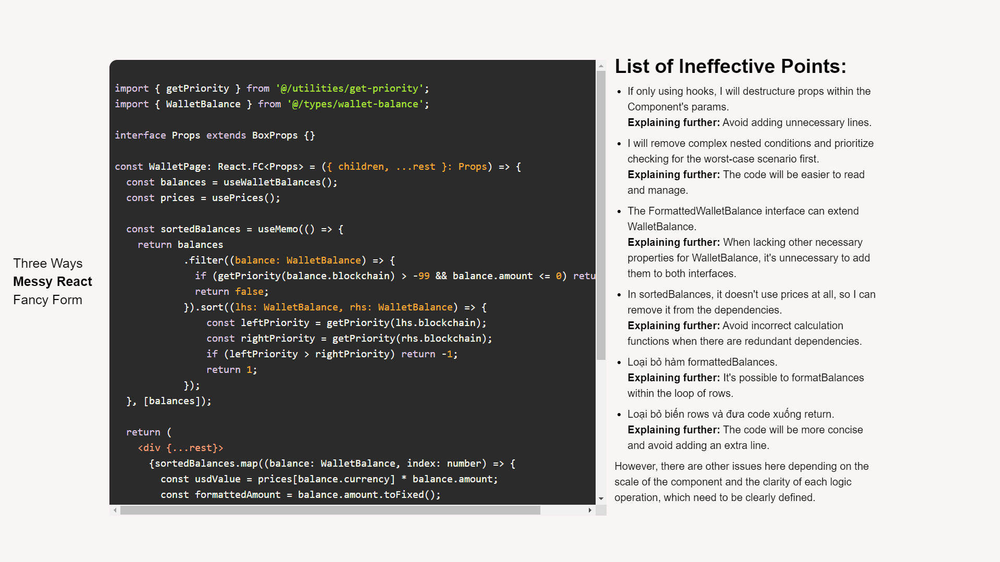

# Xin chào, HR

>NOTE: Trong repo này của tôi sẽ có một số thay đổi nhất định với repo template, nhưng chỉ với mục đích để anh HR có thể dễ nhận xét và đỡ mất thời gian của anh HR, tôi xin được phép đưa tất cả các vấn đề vào các component khác nhau và thể hiện nó lên một trang web thay vì tách ra từng folder, trân trọng.

## Hình ảnh minh họa

Vấn đề 1: Three ways to sum to n

Vấn đề 2: Fancy Form

Vấn đề 3: Messy React

## Lệnh có sẵn
Để có thể chạy được Source Code thì chỉ cần hai lệnh sau

### `npm install`

### `npm start`

